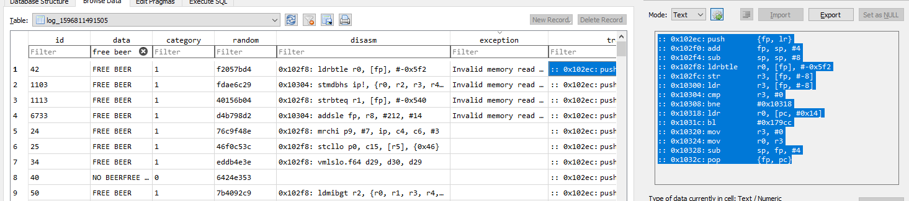
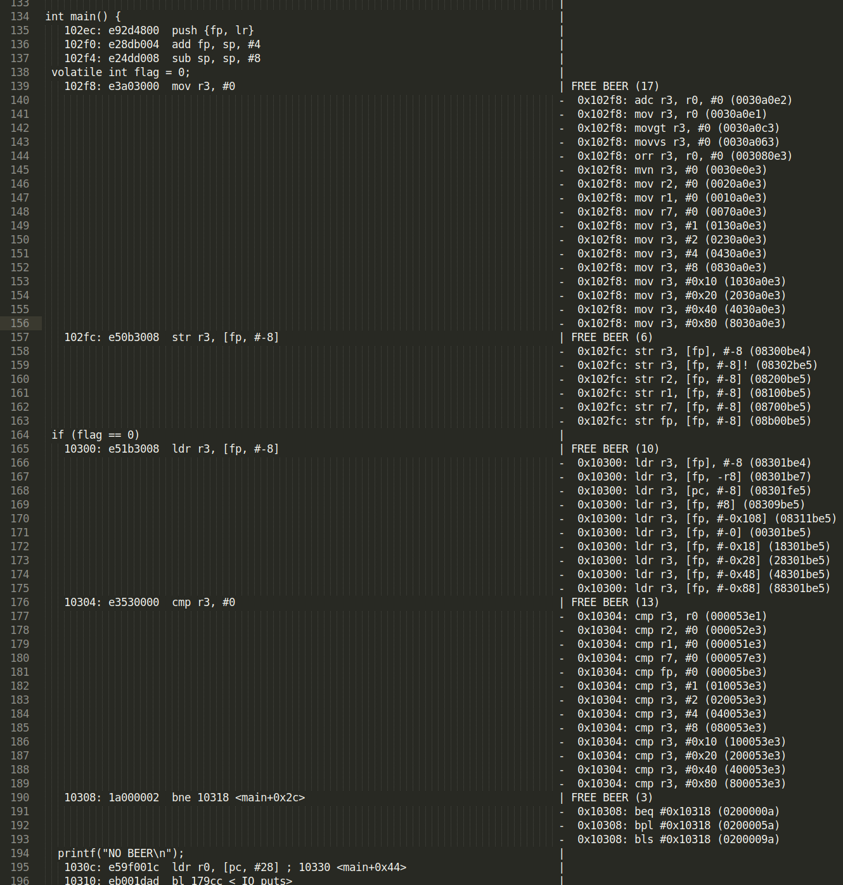
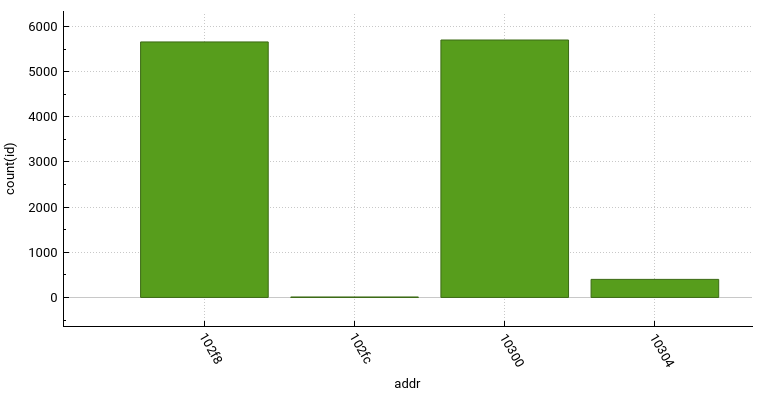

# QilingFi

Using qiling to build simple scripts simulating fault injection models. 
Some FI extensions in `QilingFi.py`.
Script template with `TODO`s in `qiling_template.py`.

Tested in Ubuntu 18.04 and WSL Ubuntu 18.04

## Setup etc.

Depends on `qiling` (obviously) and `tqdm` (for progress bars). To install:
```
python3 -m venv venv
. venv\bin\activate
python -m pip install qiling --pre
python -m pip install tqdm
```

Can also recommend getting the latest/nightly https://sqlitebrowser.org/dl/

## Snapshots

Snapshots are not in the pip version yet, need to build the qiling package yourself from dev to use:
```
apt install python3-pip git cmake
git clone https://github.com/qilingframework/qiling qiling-dev
cd qiling-dev
python3 -m venv venv 
pip install -r requirements.txt
python3 setup.py install 
```

See also: https://docs.qiling.io/en/latest/install/

# Example: ifelse.c ARM32 program

A simple if check to test with some faults:

```
volatile int flag = 0;
if (flag == 0)
	printf("NO BEER\n");
else
	printf("FREE BEER\n");
```

## Setup etc.

Set up arm linux compiler:
```
apt install gcc-8-arm-linux-gnueabi
```

Compile statically to not rely on external libs (although Qiling has very convenient functions for this!), and dump with C code inlined:
```
cd ifelse
arm-linux-gnueabi-gcc-8 -static -g ifelse.c -o ifelse
arm-linux-gnueabi-objdump -S ifelse > ifelse.objdump
```

`ifelse.objdump` can be used to very conveniently find addresses etc:
```
000102ec <main>:
#include <stdio.h>

int main() {
   102ec:	e92d4800 	push	{fp, lr}
   102f0:	e28db004 	add	fp, sp, #4
   102f4:	e24dd008 	sub	sp, sp, #8
	volatile int flag = 0;
   102f8:	e3a03000 	mov	r3, #0
   102fc:	e50b3008 	str	r3, [fp, #-8]
	if (flag == 0)
   10300:	e51b3008 	ldr	r3, [fp, #-8]
   10304:	e3530000 	cmp	r3, #0
   10308:	1a000002 	bne	10318 <main+0x2c>
		printf("NO BEER\n");
   1030c:	e59f001c 	ldr	r0, [pc, #28]	; 10330 <main+0x44>
   10310:	eb001dad 	bl	179cc <_IO_puts>
   10314:	ea000001 	b	10320 <main+0x34>
	else
		printf("FREE BEER\n");
   10318:	e59f0014 	ldr	r0, [pc, #20]	; 10334 <main+0x48>
   1031c:	eb001daa 	bl	179cc <_IO_puts>
	return 0;
   10320:	e3a03000 	mov	r3, #0
}
   10324:	e1a00003 	mov	r0, r3
   10328:	e24bd004 	sub	sp, fp, #4
   1032c:	e8bd8800 	pop	{fp, pc}
```

## Run ifelse with different fault models

Some example fault models in `fault_models.py`.
Example on how to use them in `ifelse.py`.
Testing the models on the `ifelse` binary:

```
python3 ifelse.py singlebit
python3 ifelse.py nop
python3 ifelse.py random
```

Pause with CTRL-C.

## Run ifelse with random, using snapshots and multiprocessing

Waaaaaay (10x) faster (50,000 runs in 15 minutes) than single core (using 4 cores instead) and without snapshots:

```
python3 ifelse_multisnaps.py
```

Sort of pause with CTRL-C, try to gracefully kill jobs as well.

## Some details
`QilingFi` extends some functionality of `Qiling`, by adding some hooks and variables for recording the execution trace and injecting faults. `ql.patch` is used to patch the binary with the faulty instruction. capstone is used to decompile portions of the binary, useful for tracing. `ProcessPoolExecutor` is used to spawn multiple instances from a snapshot.

While executing counters and progress can be printed using tqdm:
```
FREE_BEER: 1 | NO_BEER: 106 | EXCEPTION: 40:  26%|█████████▍                          | 174/661 [00:28<01:19,  6.12it/s]
```

Stuff is logged to sqlite3 database:


# Snapshots and multiprocessing
Snapshots can be saved and restored to speed up multiple fault simulations, using `ql.save` and `ql.restore`. Multiple fault simulations can be performed in parallel to further speed up the simulations, in the example `ifelse_snapshot_compare.py` below done using [tqdm's process_map](https://tqdm.github.io/docs/contrib.concurrent/).

## Some numbers
Timings reported by tqdm, 1000 randomized instructions at single address (0x102f8), no sqlite3 logging:
| Configuration                               |Seconds| it/s |
|---------------------------------------------|-------|------|
| Snapshot + ProcessPoolExecutor + sqlite WAL | 00:16 | 60.7 |
| Snapshot + process_map                      | 00:19 | 51.9 |
| Snapshot                                    | 00:33 | 29.4 |
| Snapshot + thread_map                       | 00:40 | 24.7 |
| No snapshot                                 | 02:25 | 06.8 |

<!-- 
# Annotated objdump

Script to parse sqlite db and add notes to the objdump (set the right TABLE_NAME manually):
```
python annotate_objdump.py
```

Example outputs added to repo, see also screenshot below:


 -->

# SQL queries and results with random bytes

FREE BEER counts with random bytes at the compare instruction:
```
SELECT data,count(id),1.0*count(id)/(sum(count(*)) over()) AS frac FROM log_1596811491505 GROUP BY data
```
|  Output                  | Count |  Frac                 |
|--------------------------|-------|-----------------------|
|                          | 8763  | 0.605137766728817     |
|\x01                      | 1     | 6.90560044195843e-05  |
|FREE BEER                 | 187   | 0.0129134728264623    |
|FREE BEER\x0a             | 180   | 0.0124300807955252    |
|\x4c\xcf\xf3\x7f          | 1     | 6.90560044195843e-05  |
|NO BEER                   | 3433  | 0.237069263172433     |
|NO BEER\x0a               | 1786  | 0.123334023893378     |
|NO BEER\x0aFREE BEER\x0a  | 130   | 0.00897728057454596   |

FREE BEER per randomized addr:
```
SELECT addr,data,count(id),1.0*count(id)/(sum(count(*)) over()) AS frac FROM log_combined GROUP BY addr, data
```
|  Output                  | Count |  Frac                    |
|--------------------------|-------|--------------------------|
| 102f8                    | 1189  | 0.0764286173426753       |
| 102f8 FREE BEER\x0a      | 1917  | 0.123224272031883        |
| 102f8 NO BEER\x0a        |    6  | 0.000385678472713248     |
| 102fc                    | 1197  | 0.076942855306293        |
| 102fc FREE BEER\x0a      |    4  | 0.000257118981808832     |
| 102fc NO BEER\x0a        | 1911  | 0.12283859355917         |
| 10300                    | 1178  | 0.075721540142701        |
| 10300 FREE BEER\x0a      | 1927  | 0.123867069486405        |
| 10300 NO BEER\x0a        |    6  | 0.000385678472713248     |
| 10304                    | 1229  | 0.0789998071607636       |
| 10304 FREE BEER\x0a      |  121  | 0.00777784919971717      |
| 10304 NO BEER\x0a        | 1761  | 0.113196631741338        |
| 10308                    | 1212  | 0.0779070514880761       |
| 10308 NO BEER\x0a        | 1899  | 0.122067236613743        |

Exception counts:
```
SELECT exception,count(id),1.0*count(id)/(sum(count(*)) over()) AS frac FROM log_1596811491505 GROUP BY exception
```
|  Exception                                          |  Count |  Frac                 |
|-----------------------------------------------------|--------|-----------------------|
| 	                                                   |  11261 | 0.657730272764441     |
| Invalid instruction (UC_ERR_INSN_INVALID)           |  1821  | 0.106360609777466     |
| Invalid memory read (UC_ERR_READ_UNMAPPED)          |  2723  | 0.159044448338298     |
| Invalid memory write (UC_ERR_WRITE_UNMAPPED)        |  1034  | 0.0603936685941242    |
| Write to write-protected memory (UC_ERR_WRITE_PROT) |  281   | 0.0164125927223877    |
|  hook_intr_cb : catched == False                    |  1     | 5.84078032825185e-05  |

# More pictures

Result of random instructions at different addresses in a bar plot:


